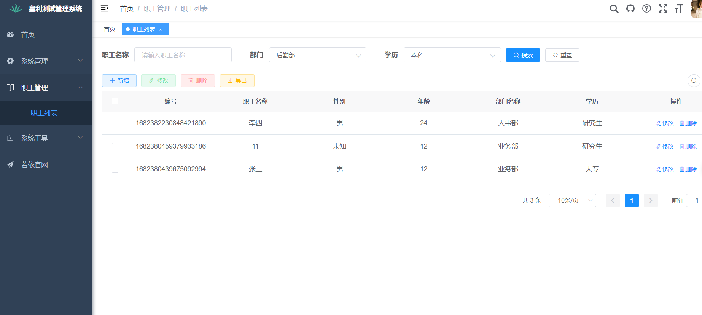

<h1 align="center" style="margin: 30px 0 30px; font-weight: bold;">济南皇利电子商务题目测试</h1>
<h3 align="center">第一题.使用Vue element admin，springboot，mysql，实现职工信息的管理功能：</h3>

1.此项目使用了若依框架进行搭建，集成了mybatisplus，hutool，lombok,swagger进行开发。其中删除了若依自带的代码生成模块和定时任务模块

2.具体步骤：创建库huang-li-test，直接导入huang-li-test.sql文件，修改一下数据库连接和redis连接即可，或者直接使用代码的环境。启动RuoYiApplication。
前端直接打开ruoyi-ui，然后npm install后直接运行即可。前端使用了80端口，后端为8080端口。

3.部门和学历字段已集成到系统配置中的字典项中，可进行配置。

4.关于职工管理的唯一字段标识，姓名无法做唯一标识，真实使用可以使用身份证号等唯一字段进行校验。

<h3 align="center">第二题.编写一个shell脚本(linux)，功能如下：
在给定文件中搜索指定内容，并将搜索结果(含内容出现的行号)保存到新的文件中，同时结果输出到控制台</h3>

1. 
grep -n "待查询内容" /path/to/file.txt > /path/to/result.txt 
grep -n "待查询内容" /path/to/file.txt

<h3 align="center">第三题.编写一个shell: 显示当前硬盘使用情况，内存使用情况，CPU使用情况</h3>

1.可使用命令行       df -h && free -m && top

